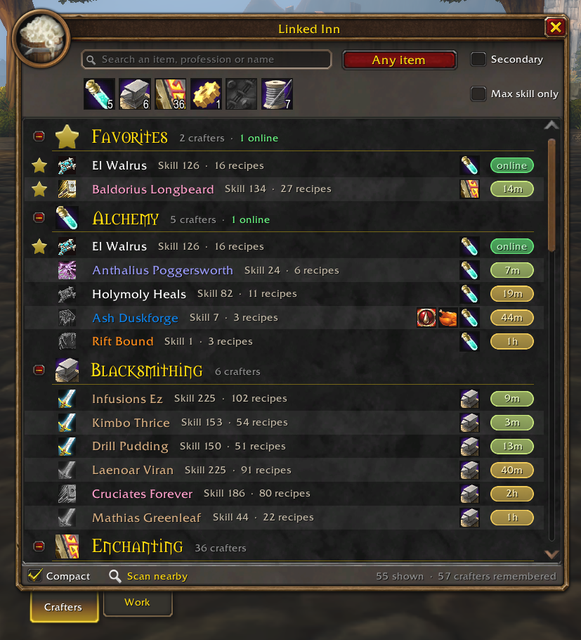

# Linked Inn: Profession Finder

Find someone who can make what you need, for **World of Warcraft: Forever**.

Linked Inn builds a list of every crafter around you and everything they can
make, all on its own. Just play: it fills up as you go about the world, with
nothing to set up or click.

When you need something made, search for it and you'll see exactly who can
make it in seconds, who's online right now, and whisper them with one click.
Nobody around? Post a request and the crafters who can make it get a notice.

> **Official download:** this repository's
> [Releases](https://github.com/sanredz/Linked-Inn/releases) and CurseForge.
> Copies uploaded anywhere else aren't official and may be modified.

> **Beta:** Linked Inn is new. If something looks off, please
> [open an issue](https://github.com/sanredz/Linked-Inn/issues).

## Where the list comes from

You don't have to do anything. Linked Inn fills the list in the background:

- **Profession links in chat.** Anyone who links a profession in Trade,
  General, guild, party, raid or a whisper gets saved with their full recipe
  list. You don't have to click the link.
- **Recipe links.** A single linked recipe or crafted item is enough to read
  that player's whole profession.
- **Other Linked Inn users.** Players with the addon quietly share their own
  professions with each other, including users on the other hidden realms of
  your ruleset.
- **What you see.** Someone crafting or disenchanting near you gets added
  too. **Scan nearby** at the bottom of the window looks up the players
  around you.

Your own professions are read when you log in, so you never have to open
them first.

## Crafters

- **Search** for an item, a profession or a name. Searching an item shows only
  the people who can make it.
- **Filter** by profession (pick several), item type, max skill only, and
  optionally the secondary professions.
- **Favorites** stay at the top. Star anyone you use a lot.
- **Last seen** shows when a crafter was last around. Click it to check if
  they're online right now.
- **Recipe books:** click a profession icon to browse that player's recipes by
  category, with reagents. Click a recipe to ask them to make it.
- **Compact** mode fits about twice as many people on screen.

  
  

## Work

A reverse auction house. Post what you want made and let the crafters come to
you, or pick up requests you can make yourself.

### Requests for you

- **For you** lists requests from other players that you can actually make,
  with the price, the mats they bring and any note.
- Click **I can make it** to send an offer, or click the request to whisper
  them.
- **Alerts:** a pop-up, a sound and a glowing minimap button when a new one
  shows up. Limit them to requests where the buyer brings all mats, pays at
  least a set price, or matches certain professions.

  

  
  

### Your requests

- **Post a request:** pick the item and amount, set how many of each material
  you bring, a price, a note, and how long it stays up. You see right away how
  many crafters on your list can make it.
- **My requests** shows everyone who offered as a name tag. Click a name to
  whisper them, right-click to invite or remove them.

## Usage

Open it with `/li`, the minimap button, or the addon menu.

## What gets shared

Only with other Linked Inn users, and only inside the game:

- Your professions, skill levels and known recipes.
- Your Work requests and offers.

Nothing is sent outside the game, and there's no website or account.

## License

All rights reserved. See [LICENSE](LICENSE).
