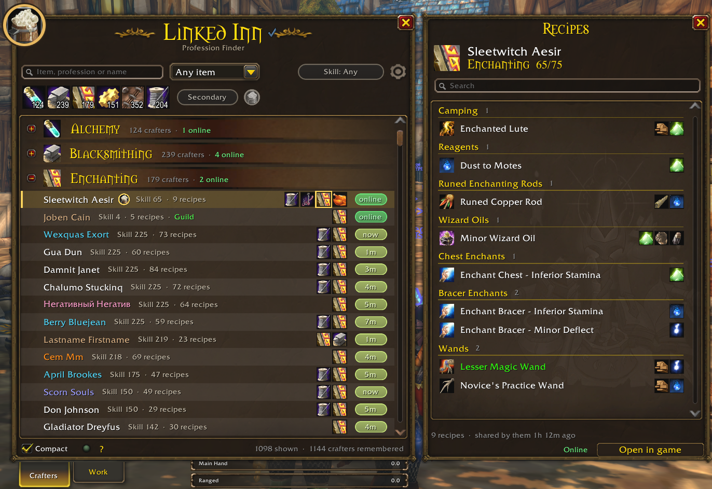
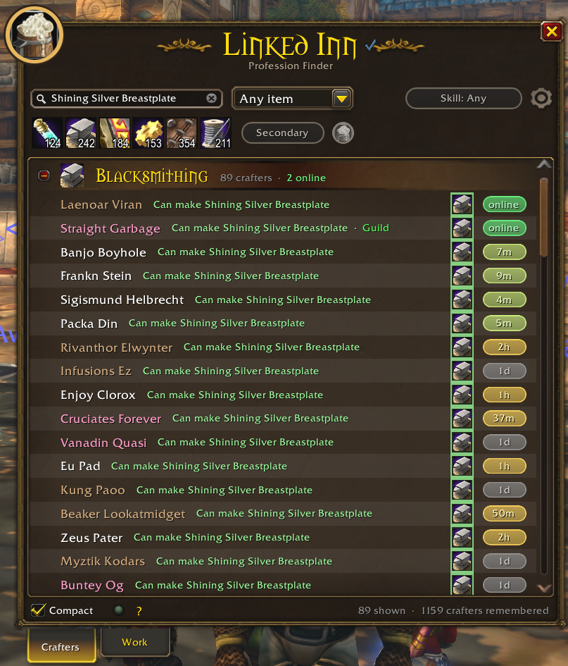
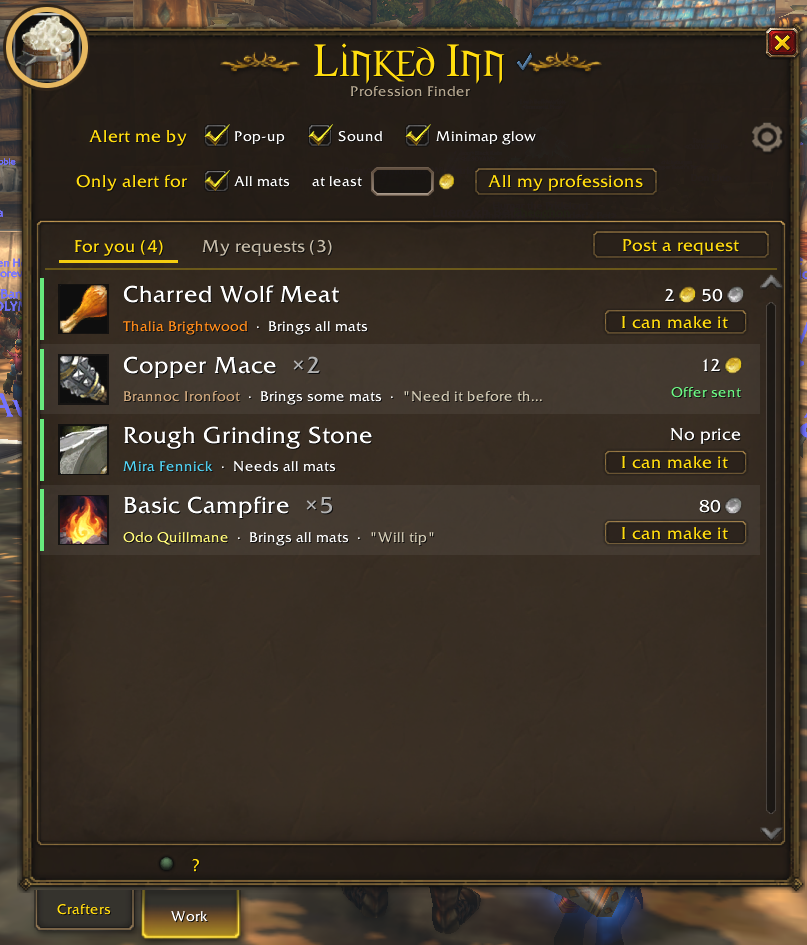
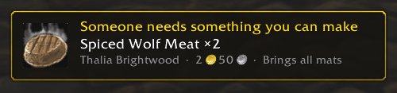
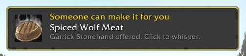
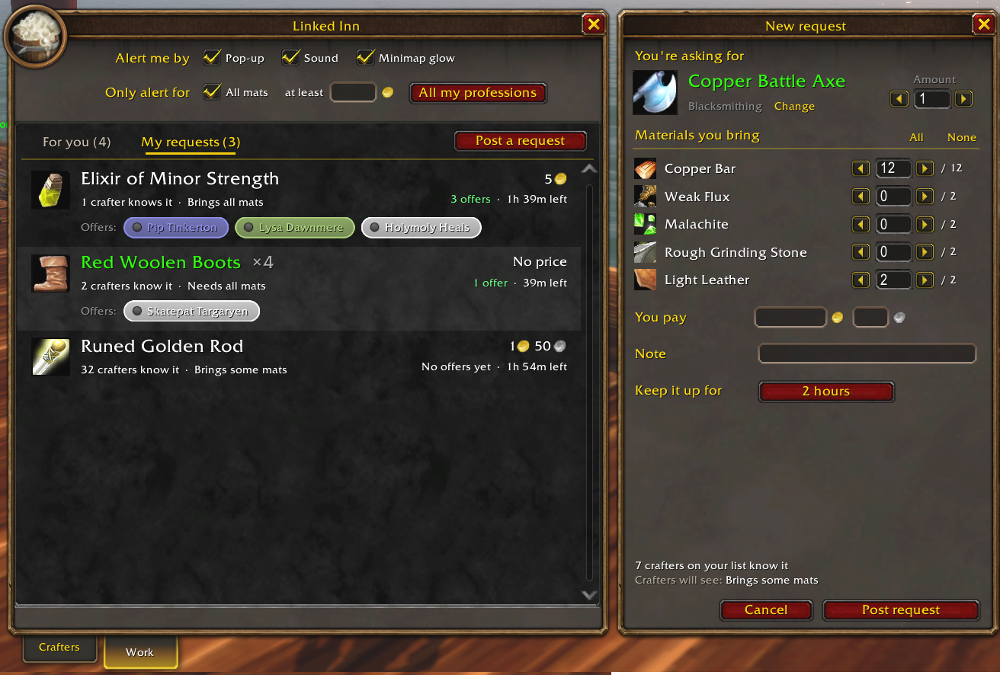

# Linked Inn: Profession Finder

Find someone who can make what you need, in **World of Warcraft** (retail)
and **World of Warcraft: Forever**.

Linked Inn builds a list of every crafter around you and everything they can
make, all on its own. Just play: it fills up as you go about the world, with
nothing to set up or click.

When you need something made, search for it and you'll see exactly who can
make it in seconds, who's online right now, and whisper them with one click.
Nobody around? Post a request and the crafters who can make it get a notice.

> **Official download:** this repository's
> [Releases](https://github.com/sanredz/Linked-Inn/releases) and CurseForge.
> Copies uploaded anywhere else aren't official and may be modified.

> **Found a bug?** If something looks off, please
> [open an issue](https://github.com/sanredz/Linked-Inn/issues).

## Where the list comes from

You don't have to do anything. Linked Inn fills the list in the background:

- **Profession links in chat.** Anyone who links a profession in Trade,
  General, guild, party, raid or a whisper gets saved with their full recipe
  list. You don't have to click the link.
- **Recipe links.** A single linked recipe or crafted item is enough to read
  that player's whole profession.
- **Other Linked Inn users.** Players with the addon quietly share their own
  professions with each other. On Forever that includes users on the other
  hidden realms of your ruleset.
- **People around you.** Anyone you see crafting, your group, your guild
  and the players around you are checked quietly in the background, a few at
  a time. Links in chat, your group and your guild always come first.

Crafters show up as soon as their recipes have been read. Your own
professions are read when you log in, so you never have to open them first.

> **City scans:** in a city or inn, friendly nameplates flash on for half a
> second every few minutes, so everyone around you gets checked. You can turn
> this off or change how often in the settings (the gear at the top right).
> Playing with friendly nameplates on (Shift+V) checks everyone you walk past
> all the time.

## Crafters

- **Search** for an item, a profession or a name. Searching an item shows only
  the people who can make it.
- **Filter** by profession (pick several), item type and skill level, and
  optionally the secondary professions.
- **Favorites** stay at the top. Star anyone you use a lot.
- **Last seen** shows when a crafter was last around. Click it to check if
  they're online right now.
- **Recipe books:** click a profession icon to browse that player's recipes by
  category, with reagents. Click a recipe to ask them to make it. The crafter
  whose book is open is highlighted in the list.
- **Compact** rows are the default, so lots of people fit on screen. Untick
  Compact at the bottom for bigger rows.
- A small gold badge marks crafters who use Linked Inn themselves. Their lists
  come straight from their own game. The mug next to Secondary shows only them.
- **Guild** and **Friend** tags show who's in your guild or on your friends
  list.

  

## Retail and Forever

One download works in both games and adjusts itself:

- **Retail:** all eight crafting professions plus Cooking. A crafter's skill is
  shown for their newest expansion, like "87/100, The War Within", and their
  recipe book covers every expansion, so old recipes for transmog, pets or toys
  are just as easy to find. Crafters from other realms you meet are read too.
  Big recipe books are read a little at a time and stored compactly, so the
  game stays smooth and the addon stays light even with thousands of crafters.
  Profession names work in every client language.
  At the Crafting Orders, a small Linked Inn panel next to the order form shows
  who on your list can make that recipe, online first. Pick a personal order
  and click a name to send it to them.
- **Forever:** the six crafting professions plus Cooking, First Aid and Fishing,
  with skill ranks from Apprentice to Artisan.

## Work

A reverse auction house. Post what you want made and let the crafters come to
you, or pick up requests you can make yourself.

### Requests for you

- **For you** lists requests from other players that you can actually make,
  with the price, the mats they bring and any note.
- Click **I can make it** to send an offer, or click the request to whisper
  them.
- **Alerts:** a pop-up, a sound and a glowing minimap button when a new one
  shows up. Limit them to requests where the buyer brings all mats, pays at
  least a set price, or matches certain professions.

  

  
  

### Your requests

- **Post a request:** pick the item and amount, set how many of each material
  you bring, a price, a note, and how long it stays up. You see right away how
  many crafters on your list can make it.
- **My requests** shows everyone who offered as a name tag. Click a name to
  whisper them, right-click to invite or remove them.

## Settings

The gear at the top right opens the settings:

- **City scans:** on or off, and how often (every 2 to 15 minutes).
- **Reading:** read profession links from chat automatically, and hide lines
  with profession links in trade, general, say and yell to cut the spam.
  They're still read.
- **Guild and friends only:** read, list and talk to your guild and friends
  list only, Work included.
  Everyone else stays saved and comes back when you turn it off.
- **Your list:** forget crafters not seen for 14, 30, 60 or 90 days, or never,
  and skip professions below a skill level. Favorites are always kept.
  **Forget everyone** starts the list over.
- **Housekeeping:** once your list is big, Light, Balanced or Strict clears
  out crafters who add nothing, keeping the best 100, 75 or 50 per profession.
  Rare recipes, favorites, guild, friends and Linked Inn users are never
  touched.
- **Minimap:** show or hide the minimap button.

## Usage

Open it with `/li`, the minimap button, or the addon menu. The light in the
bottom bar shows whether everything is working; hover it for details. The `?`
button (or `/li guide`) shows a short guide.

## What gets shared

Only with other Linked Inn users, and only inside the game:

- Your professions, skill levels and known recipes.
- Your Work requests and offers.

On Forever, Linked Inn users on your Battle.net friends list help pass these
lists along, so users on the other half of your realm can show up too.

Nothing is sent outside the game, and there's no website or account.

## License

All rights reserved. See [LICENSE](LICENSE).
